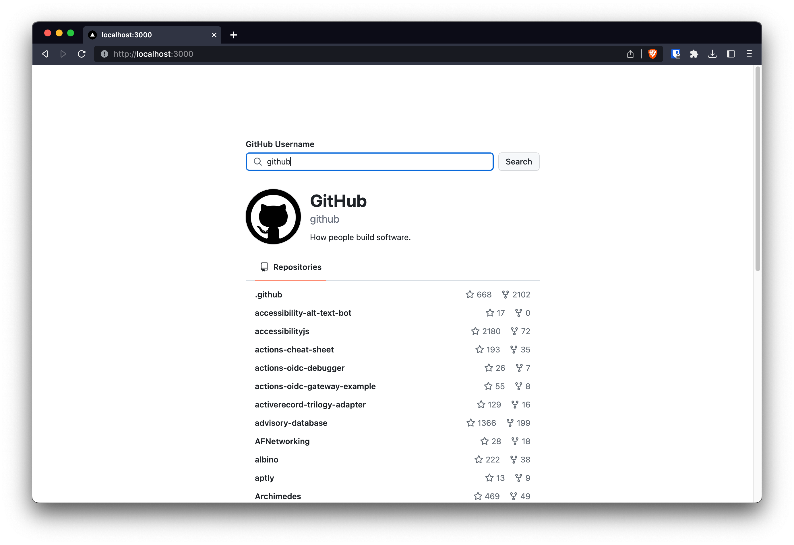

# GitHub Repo Search



## Create `.env.local` file

```plaintext
GITHUB_PERSONAL_ACCESS_TOKEN=<YOUR_GITHUB_PERSONAL_ACCESS_TOKEN>
NEXT_PUBLIC_API_BASE_URL=http://localhost:3000/api
NEXT_PUBLIC_ORIGIN=http://localhost:3000
```

## Build and run Docker image

```bash
docker build -t github-repo-search .
docker run --rm -p 3000:3000 --name github-repo-search github-repo-search
```

🥳 The application is available on http://localhost:3000
